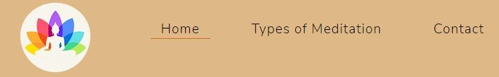
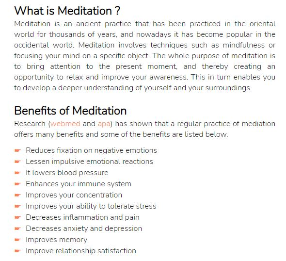
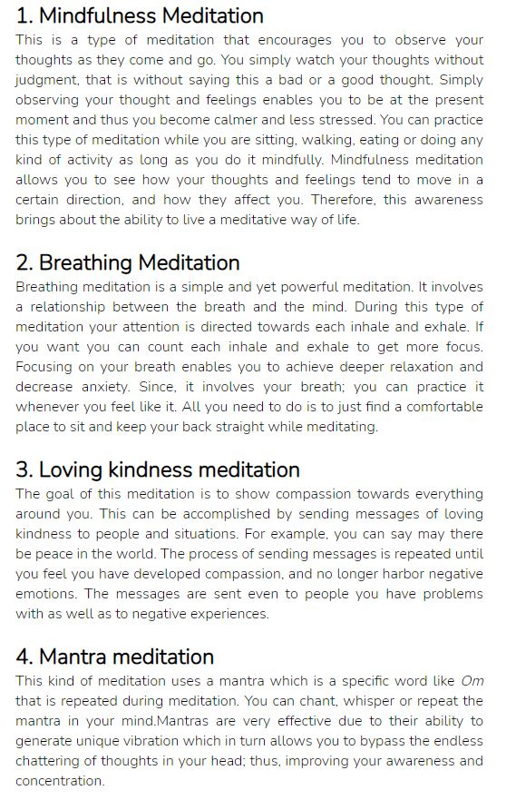
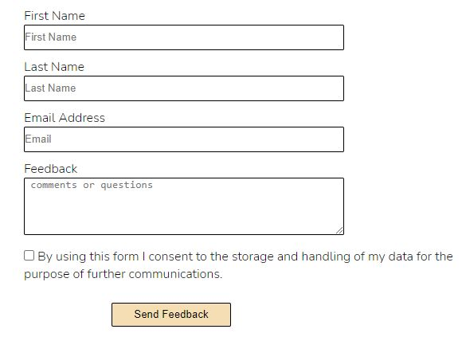
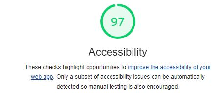
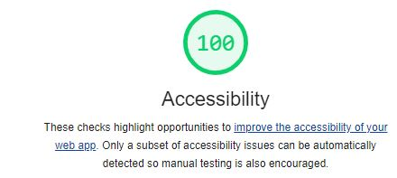
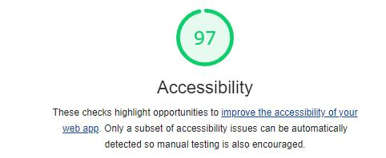

# Meditation

Nowadays we live in a very fast paced and stressful world due to work or other social issues.
 Therefore the aim of this Meditation website is intended to those who want to lead a calmer and peaceful life, and eventually a healthier life.
Since, mediation is one of the ways to achieve peace and health in your life, this website provides useful information to those who need information on how to meditate,
and it also provides a choice among four different types of mediation.

## Existing features

### Nagvigation Bar
<ul>
<li>This is featured on all of the three pages of the website. The responsive navigation bar allows the user to move between the different pages easily without having to use the back button. </li>
<li>
It contains links to the Logo of the page, the Home page, Type’s of meditation page and the Contact page. Furthermore, when the Logo is clicked it takes the user to the home page.
</li>
</ul>

### The landing page image
<ul>
<li>The hero image contains a beautiful picture of burning candle with natural stones and a flower as well as green bamboo sticks, all this can have a calming effect when the user visits the site. </li>
<li>It contains a meaningful quote to inspire the user of the website.</li>
</ul>

### The home page

 The home page contains two sections: What is meditation and Benefits of meditation

<ul>
<li>The meditation section introduces the user to meditation and explains what meditation is about.</li>
</ul>

<ul>
<li> The benefits of meditation section highlights to the user the benefits of regular mediation, and it also encourages the user to explore the different parts of the website. </li>
</ul>

  

### Types of meditation page
<ul>
<li>The contents of this page familiarize the user to the different types of meditation and explain how the user can practice each meditation. </li>
</ul>

### The contact page
<ul>
<li>This page allows the user to give comments, questions or any kind of feedback about the website by submitting their full name and email address.</li>
<li>The page includes a checkbox where the user is allowed to consent to the collection of personal information for the sole purpose of further communications. </li>
<li>It contains a submit button where the user can click after filling out the contact details and comments. </li>
</ul>

### The footer section
<ul>
<li>This section contains clickable links to Facebook, Instagram and Twitter sites which allows the user to join meditation groups as well as find furthermore information about meditation.</li>

<li>The user gets a feeling of togetherness by joining meditation groups on different social media sites and boost the user’s experience of practicing meditation. </li>
</ul>

### Testing 

<ul>
<li>This page works on different browsers: Chrome, Microsoft Edge, Firefox.</li>
<li> On smaller screen sizes the logo is located at the top of the navigation bar.</li>
<li>I checked that the page is responsive, works and looks good on the standard screen sizes (ipad,Motog4,iphone6/7/8, iphone5/SE , Galaxy s5)  using the devtools device toolbar.</li>
<li>
I have checked that the above mentioned features work as expected, the form requires entry on each field, the email field accepts only email address and the checkbox requires that the user checks it before submission, and the submit button allows the user to submit feedback.   
</li>
</ul>

### Validator Testing
<ul>
<li>HTML
  <ul>
  <li>Errors were detected when passing through the official W3C validator and they are corrected. There was a warning but it was unnecessary to address the warning.</li>
  </ul> 
</li> 

   [Home page-validation](https://validator.w3.org/nu/?doc=https%3A%2F%2Fjoh201.github.io%2Fjohn-meditation%2Findex.html)

   [Meditation types page-validation](https://validator.w3.org/nu/?doc=https%3A%2F%2Fjoh201.github.io%2Fjohn-meditation%2Fmeditation-types.html)

   [Contact page-validation](https://validator.w3.org/nu/?doc=https%3A%2F%2Fjoh201.github.io%2Fjohn-meditation%2Fcontact.html)
   

  <li>CSS
   <ul>
   <li>Errors were detected when passing through the official (Jigsaw) validator and they are corrected. </li>
   </ul>
   
</ul>

   [CSS validation](https://jigsaw.w3.org/css-validator/validator?uri=https%3A%2F%2Fjoh201.github.io%2Fjohn-meditation%2Fassets%2Fcss%2Fstyle.css&profile=css3svg&usermedium=all&warning=1&vextwarning=&lang=en)

   ### Accessbility

  #### Home page accessibility

#### Meditation types page accessibility

#### Contact page accessibility

